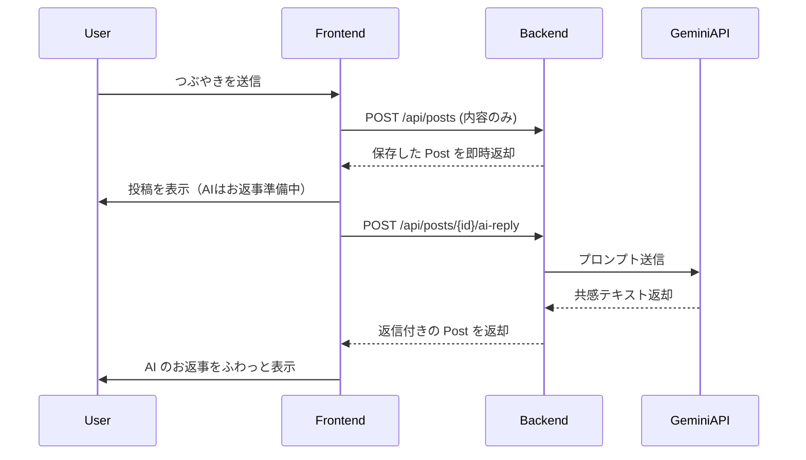
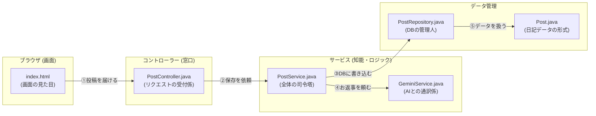

# システム設計図：komore-log (こもれログ)

## 1. システム概要
「こもれログ」は、ユーザーの日々のつぶやきに対して、AIパートナー「こもれ」が優しく共感的な言葉を返してくれる、癒やしを目的としたWebアプリケーションです。

## 2. システムアーキテクチャ
```mermaid
graph TD
    User[ユーザー (ブラウザ)] <--> Frontend[フロントエンド (HTML/JS)]
    Frontend <--> Backend[バックエンド (Spring Boot)]
    Backend <--> DB[(データベース (H2 Database))]
    Backend <--> Gemini[外部API (Google Gemini API)]
```
- **フロントエンド**: HTML/JavaScript による SPA 風の挙動。非同期通信 (Fetch API) で AI の返信を逐次更新。
- **バックエンド**: Spring Boot 3.x を使用した RESTful API サーバー。
- **AI 連携**: Google Gemini 1.5 Flash モデルと REST 通信を行い、動的に返信を生成。

## 3. 技術スタック
| カテゴリ | 技術 |
| :--- | :--- |
| 言語 | Java 17 |
| フレームワーク | Spring Boot 3.4.2 (Lombok, Validation, Web, JPA) |
| データベース | H2 Database (In-Memory / File) |
| AI API | Google Gemini API (gemini-1.5-flash-latest) |
| フロントエンド | Vanilla JavaScript (ES6+), CSS3, HTML5 |
| 環境変数管理 | .env / .vscode/launch.json / application.properties |

## 4. データベース設計
### テーブル名: `posts`
| カラム名 | 物理名 | 型 | 制約 | 説明 |
| :--- | :--- | :--- | :--- | :--- |
| 投稿ID | `id` | BIGINT | PK, AUTO_INC | 投稿の一意な識別子 |
| 内容 | `content` | VARCHAR(300) | NOT NULL | ユーザーのつぶやき内容 |
| AI返信 | `ai_reply` | TEXT | - | パートナー「こもれ」のお返事 |
| 投稿日時 | `created_at` | TIMESTAMP | NOT NULL | 投稿が作成された時刻 |

## 5. API 仕様
ベースパス: `/api/posts`

| Method | Endpoint | Description | Request Body | Response |
| :--- | :--- | :--- | :--- | :--- |
| `GET` | `/` | 全投稿の取得 | なし | `List<Post>` |
| `POST` | `/` | 新規投稿の作成 | `{"content": "string"}` | `Post` |
| `POST` | `/{id}/ai-reply` | AI 返信の生成 | なし | `Post` (更新後) |
| `DELETE` | `/{id}` | 投稿の削除 | なし | 200 OK |

## 6. AI デザイン（こもれ）の定義
AI パートナー「こもれ」の応答ロジックは `GeminiService` に集約されています。

### キャラクター設定
- **アイデンティティ**: **komore** という名前の癒やし系パートナー。
- **視覚的モチーフ**: **「葉っぱ」**。新緑のような爽やかさと、木漏れ日のような温かさを象徴。
- **口調**: 丁寧で柔らかく、相手を敬う（「〜ですね」「〜ですよ」「〜でしょうか？」）。
- **目的**: 否定せず、親身になって共感し、ユーザーの心がふっと軽くなること。

### プロンプト・制約
1. **文体**: 2〜3文ごとに改行を入れ、読みやすさを確保する（空行は挟まない）。
2. **文字数**: つぶやきには簡潔に、悩みには丁寧に応答（最大150文字程度）。
3. **安全策**: API 障害時やエラー時は、優しく微笑んでいるようなテキストを返し、体験を損なわない。

## 7. セキュリティ・環境設定
- **秘密情報**: API キーや DB パスワードは `.env` ファイルに隔離。
- **Git除外**: `.gitignore` により `.env` および起動設定が含まれる `.vscode/` を除外。
- **注入プロセス**:
    1. `.env` を作成
    2. `launch.json` の `envFile` で読み込み
    3. `application.properties` を通じて Java の `@Value` アノテーションへ注入

---

## 8. 動作フロー（シーケンス図）


## 9. プログラムの繋がり図（ファイル相関図）
このアプリを動かしている主要なファイルたちが、どのフォルダにあり、どのように繋がっているかを整理しました。



### どのファイルが何をしているの？（つながり解説）

あなたのパソコンの中にある実際のファイルと、その役割のつながりです。

| 順番 | ファイル名 (場所) | 役割 | つながりの説明 |
| :--- | :--- | :--- | :--- |
| **①** | `index.html`<br/><small>(src/main/resources/templates/)</small> | **画面の見た目** | ユーザーが入力した文字を、窓口（Controller）に送ります。 |
| **②** | `PostController.java`<br/><small>(src/main/java/.../controller/)</small> | **受付窓口** | 画面から届いた内容を受け取り、「サービスにやっておいて」と伝えます。 |
| **③** | `PostService.java`<br/><small>(src/main/java/.../service/)</small> | **司令塔** | このプログラムの「リーダー」です。データの保存とAIへの依頼を両方仕切ります。 |
| **④** | `PostRepository.java`<br/><small>(src/main/java/.../repository/)</small> | **保存の専門家** | 司令塔から頼まれて、データベース（H2）の中身を書き換えます。 |
| **⑤** | `GeminiService.java`<br/><small>(src/main/java/.../ai/)</small> | **AI通訳** | 司令塔から頼まれて、Google Geminiにお返事を作ってもらいます。 |
| **⑥** | `Post.java`<br/><small>(src/main/java/.../entity/)</small> | **データの形** | 投稿内容やお返事などをまとめておく「1件分のデータ」の定義です。 |

### 💡 要するにどう動いているの？
あなたが画面でつぶやくと...
1. **画面(`index.html`)** が **窓口(`PostController`)** にメッセージを投げます。
2. **窓口** は **司令塔(`PostService`)** に丸投げします。
3. **司令塔** は、まず **保存係(`PostRepository`)** に「日記に書いておいて」と頼みます。
4. その後、**司令塔** は **AI通訳(`GeminiService`)** に「お返事もらってきて」と頼みます。
5. 全て揃ったら、画面にお返事が表示されます。

## 11. アプリの全体構造図
プログラムと言葉とファイルを1つの図にまとめました。

```text
 ┌──────────────┐         ┌────────────────────┐         ┌────────────────┐
 │ ユーザーの画面 │   ①   │   注文を受ける窓口   │   ②    │   みんなの司令塔   │
 │ (index.html) ├────────▶│ (PostController)  ├────────▶│  (PostService)  │
 └──────────────┘         └────────────────────┘         └────────┬───────┘
        ▲                                                         │
        │                                            ┌────────────┴────────────┐
        │ ⑤ お返事を表示                              │ ③ 保存係       ④ 通訳係  │
        │                                            ▼               ▼
 ┌──────────────┐                          ┌────────────────┐  ┌───────────────┐
 │ こもれさんのお返事│◀──────────────────────────┤   書き込む本棚    │  │  外部のAI(Gemini) │
 │ (aiReply)    │                          │ (PostRepository)│  │ (GeminiService)│
 └──────────────┘                          └────────────────┘  └───────────────┘
```

### 💡 動作のまとめ
1. **画面(`index.html`)**: あなたがつぶやきを入力します。
2. **窓口(`PostController`)**: メッセージを受け取り、司令塔に渡します。
3. **司令塔(`PostService`)**: 
   - まず **保存係(`PostRepository`)** に「データベースに保存して」と頼みます。
   - 次に **通訳係(`GeminiService`)** に「Geminiにお返事をもらってきて」と頼みます。
4. **通訳係**: Gemini APIと通信して、温かい言葉を持って帰ってきます。
5. **画面**: 届いたお返事をあなたの画面に表示します。

## 10. ファイルの場所マップ（エクスプローラー）
VS Code の左側のファイル一覧と照らし合わせてみてください。

```text
komore-log (プロジェクトのルート)
 ├── .env                         (← APIキーやパスワードを隠し持っている場所)
 ├── src/main/java/com/komore/komorelog
 │    ├── ai
 │    │    └── GeminiService.java  (← ⑤ AIとおしゃべりする担当)
 │    ├── controller
 │    │    └── PostController.java (← ② ブラウザからの注文を受け取る窓口)
 │    ├── entity
 │    │    └── Post.java           (← ⑥ 日記データの項目[ID,内容,お返事]を決めている)
 │    ├── repository
 │    │    └── PostRepository.java (← ④ データベースの引き出しを出し入れする人)
 │    └── service
 │         └── PostService.java    (← ③ みんなに指示を出す司令塔)
 └── src/main/resources
      ├── application.properties   (← システムの設定項目が書かれている)
      └── templates
           └── index.html          (← ① あなたが見ている画面そのもの)
```
